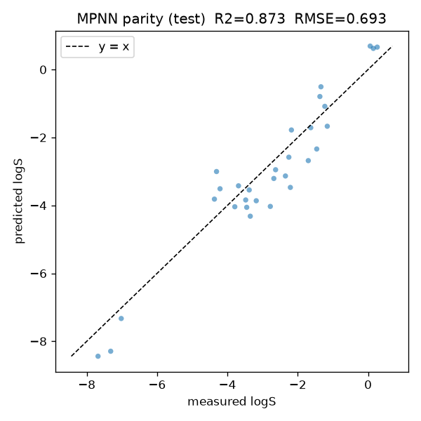

# graph-neural-networks-for-molecules

Message passing neural networks for molecular property prediction, written from
scratch in PyTorch with no graph-learning framework. Config-driven benchmark
lab: every run is one YAML file, seeds are fixed, results are committed.

## Benchmark

Aqueous solubility (logS) regression on the full public ESOL dataset (1128
molecules, seed 0, 80/10/10 split, early stopping on validation RMSE).
Reproduced this session on the full set; not copied from any prior source. Runs
are deterministic (fixed seeds, single-threaded reductions), so these numbers
regenerate exactly.

| Model          |   RMSE |    MAE |    R2 |
|----------------|-------:|-------:|------:|
| MPNN           | 0.6022 | 0.4775 | 0.924 |
| GCN            | 0.6755 | 0.5286 | 0.904 |
| FingerprintMLP | 1.2368 | 0.9264 | 0.678 |

The MPNN leads at R2 0.924 and roughly halves the error of the
Morgan-fingerprint MLP baseline. The graph convolution follows close behind;
both graph models beat the fingerprint MLP by a wide margin.



Parity plot above is the MPNN on the committed 300-molecule sample test set
(the offline-reproducible artifact, see below), predicted vs measured logS.

## Reproduce offline in 30 seconds

No download. Runs on the committed 300-molecule ESOL sample.

```bash
python scripts/benchmark.py --config configs/mpnn.yaml
```

On the 300-molecule sample the MPNN reaches RMSE 0.6934 and R2 0.873 and is the
strongest of the three models; the graph models are more data-hungry, so their
advantage over the baseline is larger on the full set than on the sample. The
full sample benchmark table and the depth ablation are in
[RESULTS.md](RESULTS.md), and are regenerated by:

```bash
python scripts/run_all.py
```

which writes `results/metrics.json`, the parity and training-curve figures, the
depth-ablation figure, the trained MPNN checkpoint `results/mpnn.pt`, and
`RESULTS.md`.

## Method

Three models under one training interface, all operating on molecular graphs
built from SMILES with RDKit:

- **MPNN**: edge-conditioned message passing with a hand-written scatter
  aggregation and a GRU node update.
- **GCN**: graph convolution with symmetric adjacency normalization and added
  self loops, computed on the edge list rather than a dense matrix.
- **FingerprintMLP**: a Morgan-fingerprint MLP, the non-graph baseline.

The scatter reductions, the message-passing convolution, and the graph
convolution are all written out in `src/gnn_molecules/layers.py`, so the
mechanics are explicit and unit tested. There is no dependency on PyTorch
Geometric or any other graph-learning library.

Variable-size graphs are batched into one disjoint graph with a `batch` index
vector for graph-level pooling. Targets are standardized with training-set
statistics and predictions are mapped back to original units for metrics.

## Depth ablation

`configs/ablation_depth.yaml` sweeps the number of message-passing layers for
the MPNN with everything else fixed. The full table and figure are in
[RESULTS.md](RESULTS.md). Run it with:

```bash
python scripts/run_all.py     # includes the ablation
```

## Configs and CLI

Every experiment is a YAML file in `configs/`:

```bash
python scripts/benchmark.py --config configs/gcn.yaml           # one model
python scripts/benchmark.py --config configs/mpnn.yaml --save results/mpnn.pt
python scripts/run_all.py                                       # full suite + ablation
```

A config names the model, dataset, split, and optimization settings. Unknown
keys are rejected with a clear error. The `dataset: synthetic` path computes an
RDKit descriptor target on a built-in SMILES set and needs no data at all.

## Install

```bash
python -m venv .venv && source .venv/bin/activate   # Windows: .venv\Scripts\activate
pip install torch --index-url https://download.pytorch.org/whl/cpu
pip install -e ".[dev]"
```

## Load the pretrained MPNN

`results/mpnn.pt` is the MPNN trained on the sample (about 0.4 MB). Load it for
instant inference without retraining:

```python
from gnn_molecules import MPNN, Trainer
from gnn_molecules.featurize import ATOM_FEATURE_DIM, BOND_FEATURE_DIM

model = MPNN(ATOM_FEATURE_DIM, BOND_FEATURE_DIM, hidden_dim=64, num_layers=3)
trainer = Trainer(model).load("results/mpnn.pt")
# trainer.predict(dataset) now returns logS in original units.
```

## Scope

This is molecular graph regression, not a general graph-learning framework. The
models are small and CPU-friendly, tuned for clarity over leaderboard accuracy.
Only regression targets are supported.

## Layout

```
src/gnn_molecules/   featurize, data, layers, models, train, config, experiment
configs/             one YAML per model, plus the depth-ablation sweep
scripts/             download_data.py, benchmark.py, run_all.py
results/             committed metrics.json, figures, and mpnn.pt
data/                esol_sample.csv committed; full set gitignored
notebooks/           demo.ipynb (executed)
tests/               pytest suite: featurization, ops, models, config, ablation
```

## Tests

```bash
pytest -q
ruff check src tests scripts
```

## License

MIT, see [LICENSE](LICENSE).

## Author

Aamir Malik. [GitHub](https://github.com/aamirmalik-dr) ·
[LinkedIn](https://linkedin.com/in/dr-aamirmalik)

---

*Refactored and engineered into this tested, reproducible project in July 2026, from work originally done for the Machine Learning for Molecules and Materials course at KAIST (Spring 2022).*
