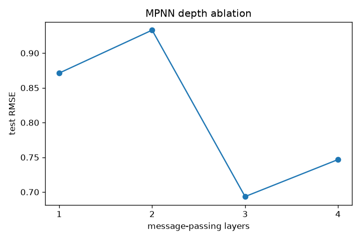

# Results

All numbers below were produced by `scripts/run_all.py` on the committed ESOL sample (300 molecules, seed 0, 80/10/10 split, early stopping on validation RMSE).

## Benchmark

| Model | RMSE | MAE | R2 | Best epoch |
|-------|-----:|----:|---:|-----------:|
| MPNN | 0.6934 | 0.6092 | 0.8727 | 91 |
| GCN | 1.0686 | 0.8584 | 0.6978 | 118 |
| FingerprintMLP | 1.1104 | 0.9157 | 0.6737 | 200 |

## Depth ablation (MPNN)

Same MPNN, only the number of message-passing layers changes.

| Layers | RMSE | MAE | R2 |
|-------:|-----:|----:|---:|
| 1 | 0.8712 | 0.7085 | 0.7991 |
| 2 | 0.9331 | 0.7724 | 0.7696 |
| 3 | 0.6934 | 0.6092 | 0.8727 |
| 4 | 0.7467 | 0.6200 | 0.8524 |

